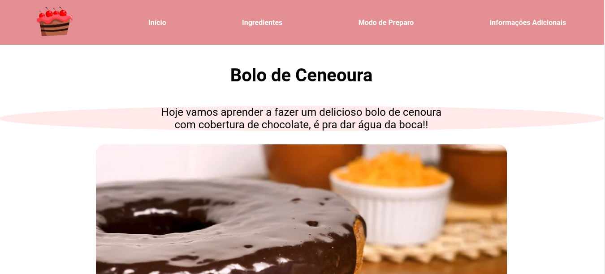
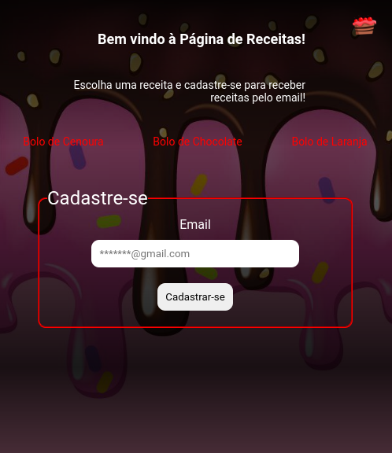
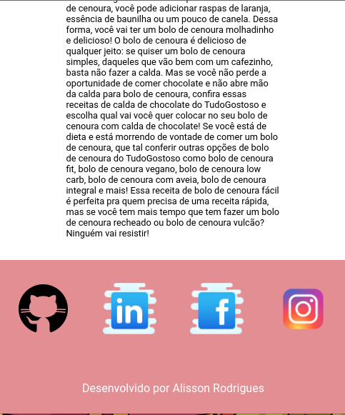

# Página de Receita

Nesse projeto foi desenvolvido uma página de receitas, contendo uma página inicial com link para 3 receitas.

##### Habilidades usadas:

- HTML 	
- CSS 	

##### Fotos do projeto finalizada:

Página inicial do projeto:

Página de uma das receitas:

Formato responsivo:

Formato responsivo página da receita:

​									
​										
​										
​										
​										 

##### Desenvolvido por Alisson Rodrigues